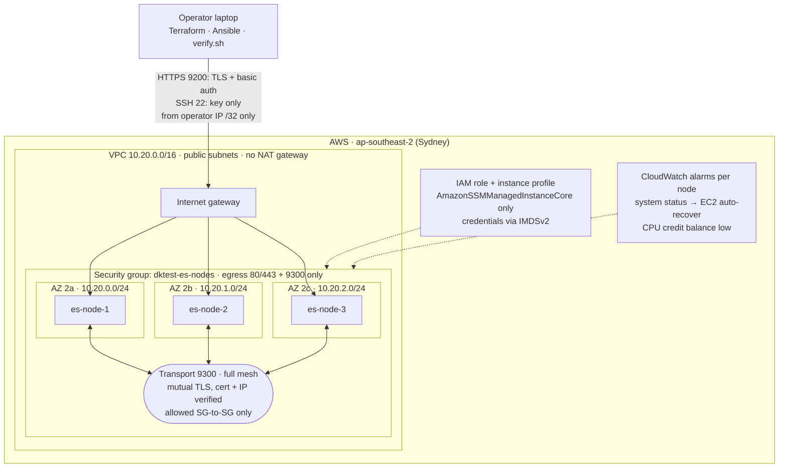
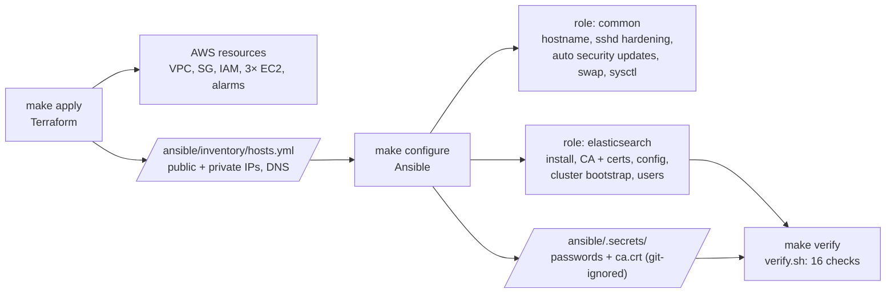
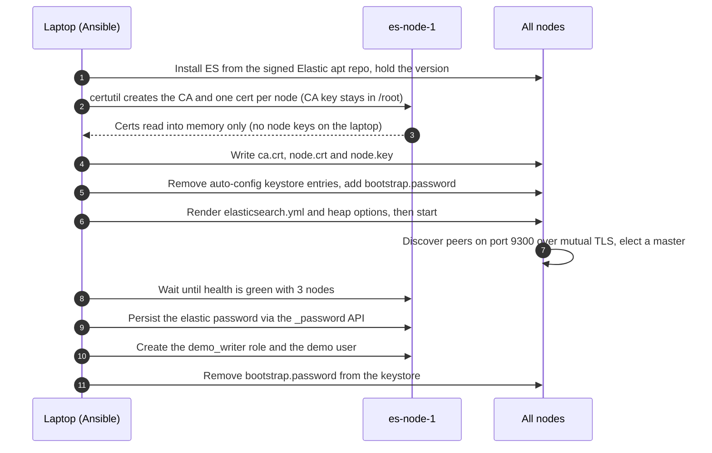

# Secure Elasticsearch on AWS (free tier)

Terraform provisions the AWS infrastructure. Ansible installs and secures
Elasticsearch on it. One variable switches between a **single node** and a
**3-node cluster** (the bonus task). The cluster has TLS on every hop, requires
authentication everywhere, and has a least-privilege demo user. A verification
script proves that it works and that it is secure.

```
make up        # terraform apply -> ansible-playbook -> verify.sh
make destroy   # tear everything down
```

---

## Contents
1. [Architecture](#architecture)
2. [Quick start](#quick-start)
3. [What `verify.sh` demonstrates](#what-verifysh-demonstrates)
4. [Design choices](#design-choices)
5. [Problems found while testing](#problems-found-while-testing)
6. [Answers to the questions](#answers-to-the-questions)
7. [Free tier and cost notes](#free-tier-and-cost-notes)
8. [Repository layout](#repository-layout)
9. [Resources consulted](#resources-consulted)
10. [Time spent and feedback](#time-spent-and-feedback)

---

## Architecture

### AWS infrastructure



Each node: `t3.micro`, Ubuntu 24.04, Elasticsearch 9.x (512 MB heap), 10 GiB
encrypted gp3 root volume, IMDSv2 required.

### Provisioning pipeline



### Cluster bootstrap sequence



| Layer | What protects it |
|---|---|
| Network | Security group allows 9200/22 **only from the operator's IP** (auto-detected). 9300 is allowed only between cluster members (the SG references itself). Egress is limited to 80/443 plus intra-cluster 9300. The default SG denies everything. |
| Transport (node↔node) | Mutual TLS with `verification_mode: full`, so each node's certificate must chain to our CA **and** match the peer's IP. |
| HTTP (client↔node) | HTTPS only. Plain HTTP is refused. Certs are signed by a private CA whose cert clients pin. |
| AuthN / AuthZ | X-Pack security with native realm users. Anonymous access is off. A `demo` user can touch only `demo-*` indices. |
| Host | IMDSv2 required (hop limit 1). Encrypted gp3 root volume. SSH accepts keys only and blocks root login. Unattended security upgrades are on. The instance role has SSM Session Manager access only, so there are no static credentials on the box. |
| Secrets | Passwords are generated by Ansible into a git-ignored `ansible/.secrets/` (mode 0700). The CA key never leaves node 1. Node private keys pass through memory only and never touch the control machine. The bootstrap password is removed from the keystore once the cluster is up. |

---

## Quick start

### Prerequisites
- Terraform ≥ 1.6, Ansible ≥ 2.15 (tested with Terraform 1.15 / ansible-core 2.20)
- `jq`, `curl`, `openssl`, `nc` (for `verify.sh`)
- AWS credentials in your environment, ideally short-lived. I used
  `aws login` (AWS CLI ≥ 2.32), which exchanges a browser console sign-in for
  temporary credentials, so there are no access keys anywhere:
  ```bash
  aws login --profile dktest --region ap-southeast-2
  export AWS_PROFILE=dktest
  aws sts get-caller-identity  # sanity check
  ```
  Any other method the AWS SDK supports also works (`aws configure sso`,
  environment variables, etc.). The principal needs permission to manage EC2,
  VPC, IAM roles/instance profiles and CloudWatch alarms.
- Region: `ap-southeast-2` (Sydney) by default. My sandbox account uses AWS's
  new sign-up experience, which pins each account to one region (Sydney for
  Indonesia) and blocks the opt-in Jakarta region. For an Indonesian bank I
  would deploy to `ap-southeast-3` (Jakarta) for data residency. That only
  needs `region = "ap-southeast-3"`; the code is region-agnostic.

### Run
```bash
cp terraform/terraform.tfvars.example terraform/terraform.tfvars   # optional overrides
make up            # = make init apply configure verify
```

Or step by step:
```bash
make keygen        # dedicated SSH key at ~/.ssh/dktest_ed25519 (if missing)
make init          # terraform init + ansible collections
make apply         # VPC, SG, IAM, EC2 x N, alarms; writes ansible/inventory/hosts.yml
make configure     # installs + secures Elasticsearch, forms the cluster
make verify        # functional + security checks
make ssh N=2       # shell on node 2
make destroy       # remove everything
```

### Single node instead of a cluster
```bash
terraform -chdir=terraform apply -var node_count=1 && make configure verify
```

### Talking to the cluster yourself
```bash
IP=$(terraform -chdir=terraform output -json nodes | jq -r '.[0].public_ip')
curl --cacert ansible/.secrets/ca.crt \
     -u "elastic:$(cat ansible/.secrets/elastic_password)" \
     "https://$IP:9200/_cluster/health?pretty"
```

---

## What `verify.sh` demonstrates

| # | Check | Expected |
|---|---|---|
| 1 | `http://` on 9200 | refused, because plaintext isn't served |
| 1 | HTTPS with our CA / without it | validates / rejected |
| 1 | Negotiated protocol | TLS 1.2 or 1.3 |
| 2 | Anonymous request, wrong password | `401` |
| 2 | `elastic` superuser | `200` |
| 2 | `demo` user on cluster APIs / non-`demo-*` index | `403` |
| 3 | Port 9300 from the internet | unreachable |
| 4 | Cluster health | `green`, all N nodes joined |
| 5 | `demo` user indexes a document, then searches it **via every node** | hit found on each node |
| 5 | Shard allocation | primary and replica on different nodes |

Output of a real run against the 3-node cluster:

```text
== Target: 3 node(s), testing via https://52.62.209.254:9200

== 1. Encryption in transit
PASS  plain HTTP is refused on 9200
PASS  TLS certificate validates against our CA
PASS  TLS without trusting our CA is rejected
PASS  negotiated protocol is TLS 1.2+

== 2. Authentication & authorization
PASS  anonymous request -> 401
PASS  wrong password -> 401
PASS  elastic superuser -> 200
PASS  demo user denied cluster APIs -> 403
PASS  demo user denied other indices -> 403

== 3. Network exposure
PASS  transport port 9300 unreachable from internet

== 4. Cluster health
{
  "name": "es-node-1",
  "cluster_name": "dktest",
  "version": "9.5.4"
}
name      ip          node.role   master heap.percent ram.percent
es-node-1 10.20.0.58  cdfhilmrstw -                54          88
es-node-3 10.20.2.250 cdfhilmrstw -                25          86
es-node-2 10.20.1.233 cdfhilmrstw *                72          89
PASS  cluster status is green
PASS  all 3 nodes joined

== 5. Index, search (as least-privilege demo user)
PASS  index a document
PASS  search finds the document via node 52.62.209.254
PASS  search finds the document via node 3.107.96.104
PASS  search finds the document via node 15.135.87.68

index      shard prirep state   node
demo-books 0     r      STARTED es-node-3
demo-books 0     p      STARTED es-node-2

== Result: 16 passed, 0 failed
```

---

## Design choices

### Terraform for infrastructure, Ansible for configuration
Each tool does what it is best at:
- **Terraform** is declarative and keeps state about cloud resources. It knows
  what exists, plans the diff and destroys cleanly, which matters for a
  free-tier account.
- **Ansible** handles the ordered, imperative, multi-node work: generate a CA
  on one node, distribute certs to all nodes, start them together, wait for a
  quorum, then create users through the API. Cloud-init `user_data` handles
  single-machine bootstrapping well but cannot coordinate across nodes. It also
  only runs on first boot, so re-applying configuration means replacing the
  instance.
- **The contract between them** is a generated inventory
  (`ansible/inventory/hosts.yml`) with each node's public and private IPs and
  DNS name. Ansible needs no AWS credentials at all.

Terraform is split into a reusable `network` module and an
`elasticsearch_cluster` module. The root module composes them, so the cluster
module can be dropped into an existing VPC.

### Elasticsearch 9.x from the official apt repo, package held
The latest major, installed from Elastic's signed repository. After install,
`dpkg` holds the package so that `unattended-upgrades` can never upgrade ES
underneath a running cluster. Upgrades should be deliberate rolling operations.
The exact version can be pinned with `es_version`.

### Own CA instead of the package's auto-configuration
ES 8 and later auto-generate self-signed certs and a random `elastic` password
on install. That works for one node, but the result can't be reproduced,
shared across nodes or automated. Instead:
- `elasticsearch-certutil` on node 1 creates **one CA** and **one certificate
  per node**, with SANs for every address in use (private IP, public IP/DNS,
  `localhost`).
- The CA key stays on node 1, readable by root only. Certificates are
  regenerated automatically if the node list or IPs change.
- The auto-config keystore entries are removed. The `elastic` password is set
  through `bootstrap.password`, which is deleted again once the security index
  exists.
- PEM files are used instead of PKCS#12, so there are no keystore passwords to
  manage.

### Tuned for a 1 GiB instance
Elasticsearch normally wants several GB of RAM. To run on free tier:
- heap is 512 MB (`-Xms` = `-Xmx`, as the bootstrap check requires)
- ML is disabled because it doesn't fit, and the GeoIP downloader is disabled
- a 1 GB swap file with `vm.swappiness=1`. Elastic recommends disabling swap,
  but on 1 GiB it is the difference between slow and OOM-killed. **This is a
  deliberate demo-only trade-off.** In production I'd use ≥ 4–8 GB instances,
  `bootstrap.memory_lock: true` and no swap.
- `cpu_credits = "standard"`, so a sustained burst throttles the instance
  instead of billing for it (t3 defaults to *unlimited*)

### Cluster topology
- Three master-eligible data nodes, one per AZ. Any single node or AZ can fail
  and the remaining two still form a quorum.
- Terraform validates `node_count` as 1 or an odd number ≥ 3. An even number of
  master-eligible nodes adds cost without adding fault tolerance.
- `cluster.initial_master_nodes` is rendered only on a node's first start
  (detected by the absence of a data directory) and removed on later runs, as
  Elastic recommends.

---

## Problems found while testing

Running the code against real AWS surfaced four bugs. Each one is fixed in the
code, and each is a useful lesson:

| Symptom | Root cause | Fix |
|---|---|---|
| `secrets_dir is undefined` | `group_vars/` sat next to `ansible.cfg`. Ansible only loads it next to the inventory or the playbook. | Moved to `ansible/inventory/group_vars/`. |
| CA zip "not found" after `certutil ca` succeeded | `elasticsearch-certutil` resolves relative `--out` paths against `ES_HOME`, not the working directory, so the CA key landed in `/usr/share/elasticsearch`. | All certutil paths are absolute. The stray key was deleted. |
| Node 1 refused to boot: `AccessDeniedException: /etc/elasticsearch/certgen` | ES watches its whole config directory, and it found a root-only `0700` directory there (the CA workspace). | The CA workspace moved to `/root/elasticsearch-certgen`, outside the config tree. |
| After a restart, a node rejected `elastic` with `401` while the other nodes accepted it | `bootstrap.password` is only a per-node keystore fallback and is never stored in the cluster. Removing it from the keystore, then restarting, left that node with no `elastic` password. | Once green, the password is saved through `_security/user/elastic/_password` before the keystore entry is removed. |

After the fixes, a fresh `ansible-playbook` run reports **`changed=0` on all
nodes** (idempotent) and `verify.sh` passes 16 of 16.

---

## Answers to the questions

### 1. What did you choose to automate provisioning and bootstrapping? Why?
Terraform plus Ansible. The rationale is in
[Design choices](#terraform-for-infrastructure-ansible-for-configuration).
In short:
- Terraform gives a reviewable plan, drift detection and a clean destroy for
  the AWS resources.
- Ansible gives idempotent, ordered, multi-host configuration, which forming a
  secure cluster needs (CA → certs → start → quorum → users).
- Both are widely known, so the next engineer can read the code.
- In production the same Ansible role would run under Packer to bake an AMI.
  Instances would then boot already configured from a Launch Template or ASG,
  which keeps SSH off the critical path.

### 2. How did you choose to secure Elasticsearch? Why?
Defence in depth, covering confidentiality, authentication and exposure:
- **Encryption.** TLS on both the HTTP and transport layers. The transport
  layer uses mutual TLS with full hostname/IP verification, so a rogue node
  without a CA-signed certificate for its own IP cannot join.
- **Authentication and authorization.** Built-in X-Pack security (free in the
  Basic licence) with RBAC. The superuser is used only for administration. The
  application-style `demo` user has index-scoped privileges and no cluster
  privileges.
- **Network.** Nothing is open to `0.0.0.0/0`. The API and SSH are restricted
  to the operator's IP, the transport port is restricted to cluster members,
  and egress is restricted.
- **Host and secrets.** Covered in the [table above](#architecture).
- **Next steps.** Put the nodes in private subnets behind an internal NLB or
  bastion and connect over VPN or PrivateLink. Issue certificates from a real
  CA (ACM Private CA or Vault PKI) with automated rotation. Store passwords in
  Secrets Manager or SSM. Use API keys or OIDC/SAML for humans and services.
  Turn on audit logging (requires a Platinum licence) or ship auth logs to a
  SIEM.

### 3. How would you monitor this instance? What metrics?
**Already in place:** CloudWatch alarms per node.
- `StatusCheckFailed_System` triggers EC2 auto-recover.
- `CPUCreditBalance` warns when the instance is about to be throttled.
- Alarms can notify an SNS topic through `alarm_sns_topic_arn`.

**What I would add**, using Metricbeat or Elastic Agent sending to a separate
monitoring cluster, or Prometheus `elasticsearch_exporter` with Grafana and
Alertmanager:

| Area | Metrics / signals | Why |
|---|---|---|
| Cluster | `cluster health` status, `number_of_nodes`, unassigned/initializing/relocating shards, pending tasks, master changes | yellow/red or node loss is the top-level SLO signal |
| JVM | heap used % (alert > 75–85% sustained), old-gen GC count/time, GC pauses | heap pressure leads to GC storms, then circuit breakers, then OOM |
| Resources | CPU, load, **disk used % vs. watermarks** (85/90/95%), disk IOPS/latency, swap usage | at the flood-stage watermark indices become read-only |
| Performance | indexing rate/latency, search rate/latency (p95/p99), refresh/merge times, thread-pool **rejections** (write/search), circuit-breaker trips | user-facing latency and back-pressure |
| Security | failed authentication rate, TLS handshake errors, certificate expiry (days left) | brute force, misconfiguration, expired certs |
| Host / AWS | EC2 status checks, CPU credits, EBS burst balance, network in/out | infrastructure-level faults |

I would alert on the symptoms (red/yellow health, rejections, latency, disk
watermarks) and keep the causes (heap, GC, CPU) on dashboards.

### 4. Could you extend this to a secure cluster? What needs to change?
**It is already done.** Set `node_count = 3` (the default). The parts that make
it work:
- Terraform creates N instances across AZs, and the SG allows 9300 only
  between members.
- One CA signs per-node certs with SANs for each node's IP, and transport TLS
  verifies them.
- `discovery.seed_hosts` lists the members' private IPs. Ansible removes
  `cluster.initial_master_nodes` after bootstrap.
- Indices use `number_of_replicas: 1`, so the cluster stays green with one node
  down.

For production I would add:
- dedicated master nodes (3 small) separate from data nodes, plus
  coordinating-only nodes for heavy query fan-out
- shard-allocation awareness on `aws_availability_zone`
- discovery through the `discovery-ec2` plugin (by tag) or a Route53 record
  instead of static IPs, so nodes can come and go
- an internal load balancer in front of the HTTP layer

### 5. Replace a running ES instance with little or no downtime? How?
Yes. Because it's a cluster with replicas, a node can be replaced while serving
traffic:
1. **Drain it.** Set
   `PUT _cluster/settings {"persistent":{"cluster.routing.allocation.exclude._name":"es-node-2"}}`
   and wait until the node holds no shards.
2. **Add the replacement.** For example, bump the count or create a new
   instance through Terraform with `create_before_destroy`. Ansible then issues
   its certificate and it joins through discovery.
3. **Remove the old node.** Wait for green, terminate the old instance
   (`terraform apply -replace=...`), then clear the exclusion.
4. If the old node was the elected master, the remaining masters re-elect in
   seconds. If you replace master-eligible nodes, do it one at a time so
   quorum is never lost (use `POST _cluster/voting_config_exclusions` when
   removing more than one).

For **config changes or upgrades in place**, do a rolling restart:
1. Disable replica allocation (`cluster.routing.allocation.enable: primaries`).
2. Flush.
3. Restart one node.
4. Wait for it to rejoin, re-enable allocation and wait for green.
5. Repeat for the next node.

In Ansible that's a play with `serial: 1` and health gates. (The current
handler restarts all nodes together, which is right for first bootstrap but not
for a live cluster.) For a **single node**, the options are snapshot to S3 and
restore onto a new node behind a stable DNS name or EIP, or briefly turn it into
a two-node cluster, let replicas sync, then remove the old node. Putting data
on a separate EBS volume would also let a replacement instance re-attach it.

Note that the AMI is in `ignore_changes`, so a new Ubuntu image never silently
replaces a node.

**Observed while testing.** One node was restarted while I polled
`_cluster/health` through another node every 15 s. The cluster never stopped
serving:

| Time | Status | Nodes | What happened |
|---|---|---|---|
| 22:02 | green | 3 | steady state |
| 22:05 | yellow | 2 | node 1 down; its replica is missing |
| 22:06 | green | 2 | replica rebuilt on a surviving node |
| 22:10 | green | 3 | node 1 rejoined |

### 6. Was well-structured, extensible, reusable code a priority?
Yes, within the time box:
- Terraform modules (`network`, `elasticsearch_cluster`) with typed, validated
  variables.
- Ansible roles (`common`, `elasticsearch`) with all tunables in role defaults
  (version, heap, cert validity, demo role).
- Idempotent re-runs.
- One Makefile entry point and an automated verification script.
- Everything scales by changing one variable (`node_count`), and the instance
  type and architecture are parameterized (arm64 works for t4g).

### 7. What sacrifices did you make due to time?
- **Public subnets and SSH** instead of private subnets with a bastion or SSM,
  and an AMI baked with Packer. Mitigated by /32 SG rules and key-only SSH.
- **Local Terraform state** instead of an S3 backend with locking.
- **Self-managed CA with a long-lived cert** instead of ACM PCA or Vault PKI
  with automated rotation. There is no cert-expiry automation yet.
- **Secrets in local files** instead of Secrets Manager or SSM Parameter Store.
- **Swap and a 512 MB heap** to fit free tier, and data on the root volume
  rather than a dedicated EBS volume.
- **No log shipping or metrics stack.** Monitoring is described rather than
  deployed beyond the basic CloudWatch alarms.
- **No snapshots** (repository-s3 plugin + S3 bucket + IAM) and no automated
  tests (Molecule for the role, Terratest or `terraform test` for modules).
- The handler restarts nodes in parallel rather than rolling.
- **Startup is slow on `t3.micro`.** ES takes about 5 minutes to start
  because CPU credits are capped at baseline (`standard` mode). That's
  acceptable for a demo; production would use larger, non-burstable instances.

---

## Free tier and cost notes

| Item | Free-tier position |
|---|---|
| Account | My sandbox is on AWS's credit-based **Free plan** (new sign-up experience): $120 credits, no charges unless the account is upgraded. |
| EC2 `t3.micro` × 3 | Free-tier eligible. The free allowance is instance-*hours*, so 3 nodes use it 3× faster. Fine for a demo, but **run `make destroy` afterwards**. On a legacy 12-month free-tier account in a region where `t2.micro` is the eligible type, set `instance_type = "t2.micro"`. |
| EBS gp3 3 × 10 GiB, encrypted | Within the 30 GiB allowance. Uses the AWS-managed `aws/ebs` key (no KMS charge). |
| Public IPv4 × 3 | AWS charges for public IPv4 addresses; the free tier/credits cover a limited number of hours. |
| VPC, subnets, IGW, SG, IAM, key pair | No charge |
| CloudWatch alarms (6) | Within the 10 free alarms |
| Cross-AZ traffic | ~$0.01/GB for replication between AZs; negligible here |
| **Not used** (cost) | NAT Gateway, load balancer, KMS CMK, Secrets Manager, Amazon OpenSearch Service |

**Additional services used beyond EC2:** VPC networking, IAM (instance role),
CloudWatch (alarms), Systems Manager (Session Manager access through the
instance role; optional, free).

---

## Repository layout

```
.
├── Makefile                     # single entry point (make help)
├── terraform/
│   ├── main.tf                  # composes modules, auto-detects operator IP, writes inventory
│   ├── variables.tf / outputs.tf / versions.tf
│   ├── terraform.tfvars.example
│   ├── templates/inventory.yml.tftpl
│   └── modules/
│       ├── network/             # VPC, public subnet per AZ, IGW, deny-all default SG
│       └── elasticsearch_cluster/
│           ├── main.tf          # AMI lookup, key pair, EC2 instances (IMDSv2, encrypted EBS)
│           ├── security.tf      # SG rules: 9200/22 from operator, 9300 intra-cluster, tight egress
│           ├── iam.tf           # SSM-only instance role
│           └── monitoring.tf    # CloudWatch alarms (auto-recover, CPU credits)
├── ansible/
│   ├── ansible.cfg
│   ├── playbooks/site.yml
│   ├── inventory/group_vars/all.yml  # generated passwords (git-ignored files)
│   └── roles/
│       ├── common/              # hostname, packages, auto-updates, sshd hardening, swap, sysctl
│       └── elasticsearch/
│           ├── tasks/install.yml    # signed apt repo, install, hold
│           ├── tasks/certs.yml      # CA + per-node certs, distribution
│           ├── tasks/configure.yml  # keystore cleanup, bootstrap password, config, start
│           ├── tasks/security.yml   # wait for green, RBAC role + demo user
│           └── templates/           # elasticsearch.yml, heap.options, instances.yml
└── scripts/verify.sh            # functional + security verification
```

---

## Resources consulted
- Elastic docs: [Set up basic security plus HTTPS](https://www.elastic.co/docs/deploy-manage/security/set-up-basic-security-plus-https),
  [elasticsearch-certutil](https://www.elastic.co/docs/reference/elasticsearch/command-line-tools/certutil),
  [Install with Debian package](https://www.elastic.co/docs/deploy-manage/deploy/self-managed/install-elasticsearch-with-debian-package),
  [Bootstrap checks](https://www.elastic.co/docs/deploy-manage/deploy/self-managed/bootstrap-checks),
  [Discovery and cluster formation](https://www.elastic.co/docs/deploy-manage/distributed-architecture/discovery-cluster-formation),
  [Rolling restart](https://www.elastic.co/docs/deploy-manage/maintenance/start-stop-services/full-cluster-restart-rolling-restart-procedures),
  [Built-in users / bootstrap password](https://www.elastic.co/docs/deploy-manage/users-roles/cluster-or-deployment-auth/built-in-users)
- Terraform AWS provider docs (`aws_instance`, `aws_vpc_security_group_*_rule`)
- Ansible module docs (`uri`, `slurp`, `ansible.posix.sysctl`, `password` lookup)
- AWS docs: EC2 free tier, IMDSv2, simplified automatic recovery, burstable
  credit modes

<!-- TODO: add anything else you looked up while doing the exercise -->

## Time spent and feedback
<!-- TODO (candidate): fill in honestly -->
- **Time spent:** _TBD_
- **Feedback:** _TBD_
